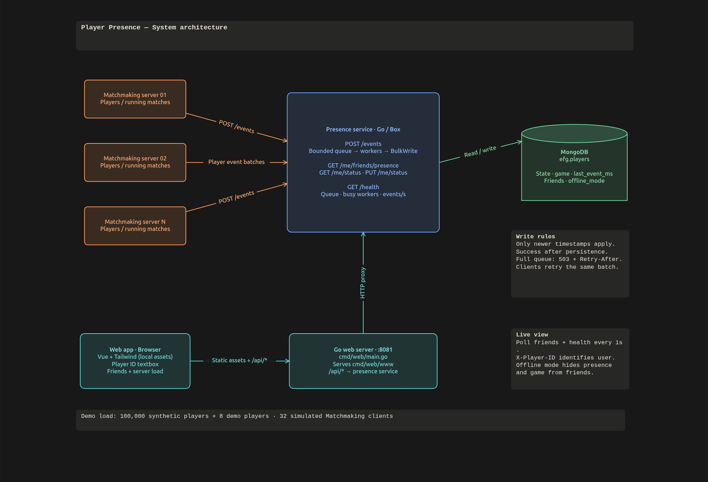
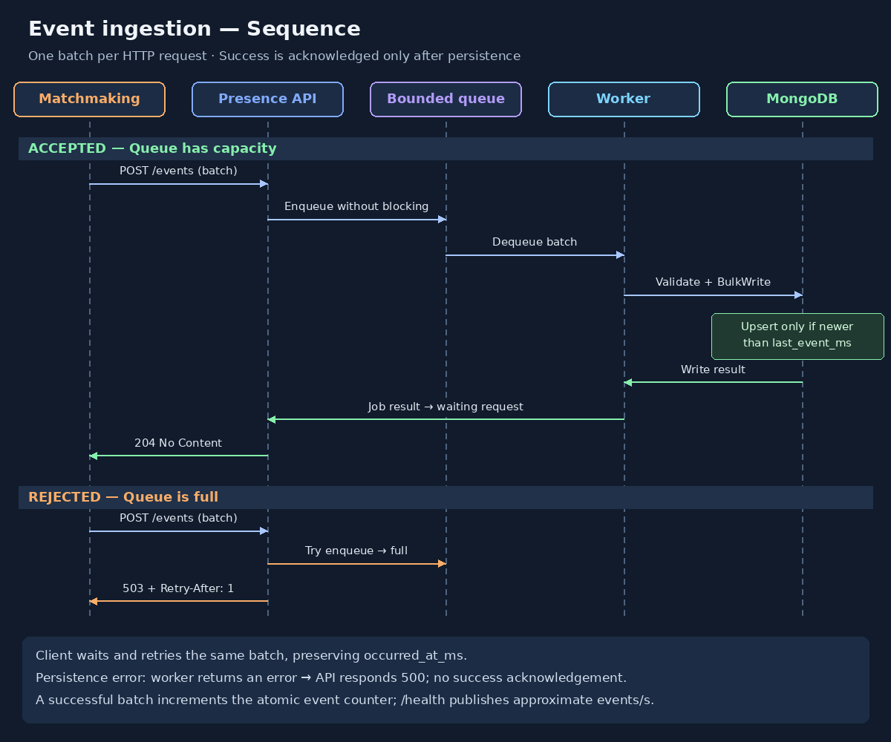

# EFG
Technical Assignment: Player Presence Service

Go project using [Box](https://github.com/fulldump/box) for the API and
[goconfig](https://github.com/fulldump/goconfig) for configuration. 
HTTP assertions and routing alternatives use [Biff](https://github.com/fulldump/biff).

## Requirements

Go 1.25.6 or later, Make, and Docker with Docker Compose.

## System Design



## Events Ingestion Sequence




## Web demo

- Run `make run`

Docker Compose starts
- MongoDB, seeds eight demo players plus 100,000 synthetic players
- the presence API on port 8080
- the web server on port 8081
- a background presence simulator

The first build downloads Go and MongoDB images.

- open **http://localhost:8081**


`make run` seeds before starting the simulator. To run them locally with the
API already running:

```sh
make seed ARGS='-simulate -api http://localhost:8080'
```

Tune load with `-users`, `-clients` and `-interval`. Use the same `-users` value
for seeding and simulation; the simulation does not reseed the database.
For example, to reduce background traffic:

```sh
make seed ARGS='-simulate -clients 40 -interval 100ms'
```

To stop automatic changes while keeping the demo running:

```sh
docker compose stop simulator
```
